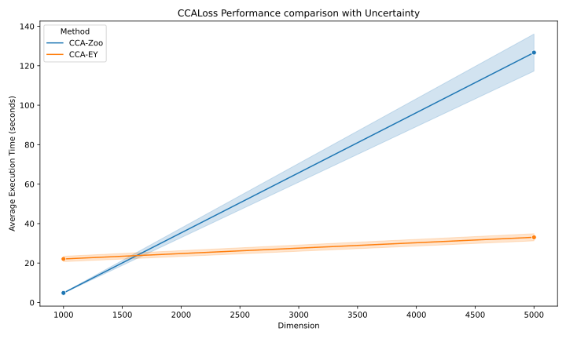

<div align="center">


# CCA-Zoo

**Unlock the hidden relationships in multiview data.**

[](https://doi.org/10.5281/zenodo.4382739)
[](https://codecov.io/gh/jameschapman19/cca_zoo)

[](https://cca-zoo.readthedocs.io/en/latest/?badge=latest)
[](https://pypi.org/project/cca-zoo/)
[](https://pypi.org/project/cca-zoo/)
[](https://doi.org/10.21105/joss.03823)


</div>

## Introduction

In today's data-driven world, revealing hidden relationships across multiview datasets is critical. **CCA-Zoo** is your go-to library, featuring a robust selection of linear, kernel, and deep canonical correlation analysis methods.

Designed to be user-friendly, CCA-Zoo is inspired by the ease of use in `scikit-learn` and `mvlearn`. It provides a seamless programming experience with familiar `fit`, `transform`, and `fit_transform` methods.

## 📖 Table of Contents

- [Quick Start](#-quick-start)
- [Performance Highlights](#-performance-highlights)
- [Detailed Documentation](#-detailed-documentation)
- [How to Cite](#-how-to-cite)
- [Contribute](#-contribute)
- [Acknowledgments](#-acknowledgments)

## 🚀 Quick Start

### Installation

Whether you're a `pip` enthusiast or a `poetry` aficionado, installing CCA-Zoo is a breeze:

```bash
pip install cca-zoo
# For additional features
pip install cca-zoo[probabilistic, visualisation, deep]
```

For Poetry users:

```bash
poetry add cca-zoo
# For extra features
poetry add cca-zoo[probabilistic, visualisation, deep]
```

Note that `deep` requires `torch` and `lightning` which may be better installed separately following the [PyTorch installation guide](https://pytorch.org/get-started/locally/).

`probabilistic` requires `numpyro` which may be better installed separately following the [NumPyro installation guide](https://num.pyro.ai/en/stable/getting_started.html#installation).

`visualisation` requires `matplotlib` and `seaborn`

## 🏎️ Performance Highlights
CCA-Zoo shines when it comes to high-dimensional data analysis. It significantly outperforms scikit-learn, particularly as dimensionality increases. For comprehensive benchmarks, see our [script](benchmark/cca_high_dimensions.py) and the graph below.




## 📚 Detailed Documentation

Embark on a journey through multiview correlations with our [comprehensive guide](https://cca-zoo.readthedocs.io/en/latest/).

## 🙏 How to Cite

Your support means a lot to us! If CCA-Zoo has been beneficial for your research, there are two ways to show your appreciation:

1. Star our GitHub repository.
2. Cite our research paper in your publications.

For citing our work, please use the following BibTeX entry:

```bibtex
@software{Chapman_CCA-Zoo_2023,
author = {Chapman, James and Wang, Hao-Ting and Wells, Lennie and Wiesner, Johannes},
doi = {10.5281/zenodo.4382739},
month = aug,
title = {{CCA-Zoo}},
url = {https://github.com/jameschapman19/cca_zoo},
version = {2.3.0},
year = {2023}
}
```

Or check out our JOSS paper:

📜 Chapman et al., (2021). CCA-Zoo: A collection of Regularized, Deep Learning based, Kernel, and Probabilistic CCA methods in a scikit-learn style framework. Journal of Open Source Software, 6(68), 3823, [Link](https://doi.org/10.21105/joss.03823).

## 👩‍💻 Contribute

Every idea, every line of code adds value. Check out our [contribution guide](https://cca-zoo.readthedocs.io/en/latest/developer_info/contribute.html) and help CCA-Zoo soar to new heights!

## 🙌 Acknowledgments

Special thanks to the pioneers whose work has shaped this field. Explore their work:

- Regularised CCA/PLS: [MATLAB](https://github.com/anaston/PLS_CCA_framework)
- Sparse PLS: [MATLAB SPLS](https://github.com/jmmonteiro/spls)
- DCCA/DCCAE: [Keras DCCA](https://github.com/VahidooX), [Torch DCCA](https://github.com/Michaelvll/DeepCCA)
